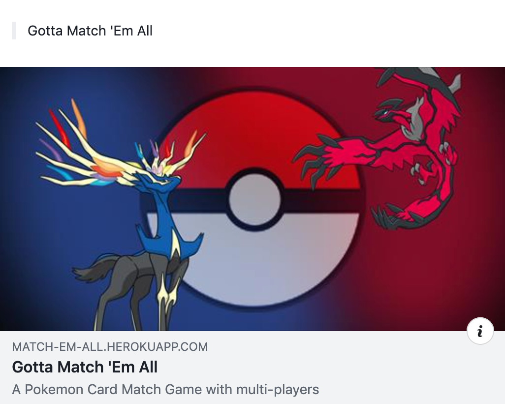
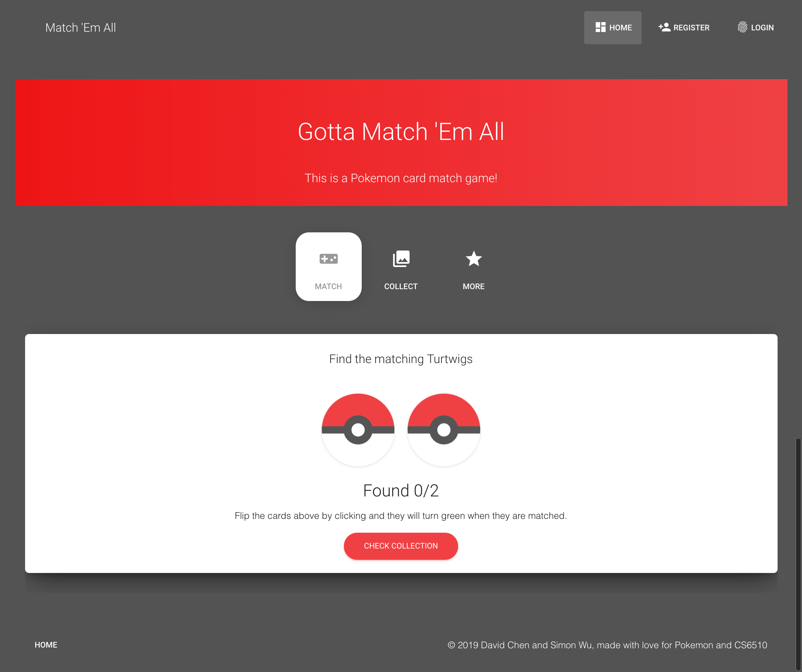

# Gotta Match 'Em All Usability Full Report

> April 23, 2019

## Table of Content

* [Overview & Top Findings](#Overview--Top-Findings)
* [Project Methodology](#Project-Methodology)
* [User Profile](#User-Profile)

---

## Overview & Top Findings

The goal of this research effort was to assess to overall usability of the <https://match-em-all.herokuapp.com> website while it is still in development. To meet this goal, a usability study was conducted of the current website design.

### Top Findings

* **Comments**

   Some Explanation...

---

## Project Methodology

**Four** users were invited to participate in a usability study of the <https://match-em-all.herokuapp.com> web site. During the test session, users were asked to perform several tasks including signing up to become a member, matching pokemons, checking collections, and sharing to social media. Users’ errors, comments, and satisfaction ratings were observed and recorded during the study. 

---

## User Profile

The participants were all non-technical people. 

User # | Sex / Age | Job Title / Company |  Platform / Browser | Prepared By
--- | --- | --- | --- | ---
1 | M / 30 | Student | Mac / Safari | David
2 | F / 24 | ... | Windows / Firefox | David

---

## Usability Findings & Recommendations

### Home Page Issues

#### 1. Web Site Visitation

  

After looking at this sharing post, users were asked to predict whether they would visit the web site. Users’ responses are summarized in the table below. 

User | Would you visit the website? | User Comments
--- | --- | ---
1 | Yes / Maybe / Probably Not | If I were led to it with some sort of ???

#### 2. First Clicks from Home

  

Users were next asked to look at the home page and comment on which links they would click. Most users would have visited the "What is Match 'Em All?" page as well as the Online Demo.

User | First Links Selected
--- | ---
1 | Pokemon Ball

#### 3. Would You Sign Up?

After exploring the home page, users were asked if they would sign up to play the game. If users hesitated, they were asked what additional information they would need to see before joining.

User | Would you sign up? | Information Wanted Prior to Signing Up | Comment
--- | --- | --- | ---
1 | Yes / Maybe / No | ??? | ???

### Home Page Questionnaire

#### 4. User Comments about the Home Page

User | Comment
--- | ---
1 | Pokemon Ball

#### 5. Users’ Ratings after Initial Exploration

Based on what you see on this page, what are your expectations for using this site?

 User | Confusing (0)   Clear (10) | Difficult to Use (0)   Easy to Use (10) | Comment 
 --- | --- | --- | ---
 1 | 3 | 3 | ??? 
 **Mean** | 3 | 3 | ??? 

---

## Final Questions

